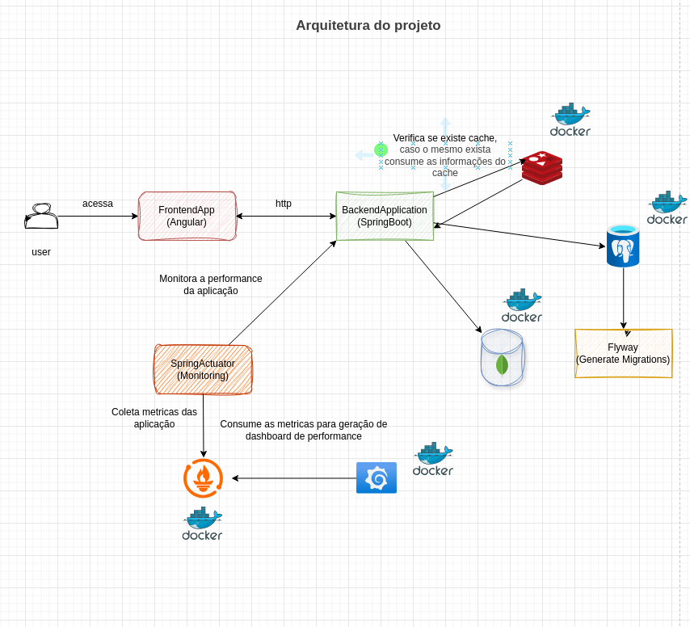

# Documentação do Sistema de Gestão de Oficina

## 1. Gestão de Clientes

Este módulo é responsável por gerenciar as informações dos clientes de maneira eficiente e segura. Ele não apenas armazena dados, mas também garante validação e integridade das informações, evitando duplicidade e erros comuns. O sistema permite um acesso rápido e seguro aos dados, facilitando a administração da base de clientes da oficina.

### Funcionalidades principais:
- **Cadastro inteligente de clientes**: O sistema coleta e valida automaticamente os dados essenciais, como CPF e e-mail, evitando inconsistências e garantindo dados sempre confiáveis.
- **Atualização simplificada**: Permite a atualização de informações dos clientes com rapidez, mantendo sempre os dados atualizados sem complicação.
- **Exclusão segura**: Permite que os dados dos clientes sejam removidos de forma controlada, garantindo a integridade da base de dados.
- **Consultas avançadas**: Oferece filtros e buscas por múltiplos parâmetros (como CPF, nome, e ID), tornando a consulta mais eficiente.

### Diferenciais:
- **Validação de dados**: O sistema assegura que o CPF e o e-mail sejam exclusivos, evitando duplicidades e problemas de cadastro.
- **Escalabilidade**: A estrutura do sistema permite o fácil crescimento da base de dados de clientes, sem comprometer a performance.

---

## 2. Gestão de Veículos

Este módulo garante um controle completo sobre os veículos que são atendidos pela oficina. Através de registros completos e atualizados, ele permite o acompanhamento detalhado de cada veículo, promovendo eficiência na prestação de serviços e manutenção do histórico de atendimento.

### Funcionalidades principais:
- **Cadastro completo de veículos**: Inclui todas as informações relevantes do veículo (marca, modelo, placa, ano, etc.), com a possibilidade de associar cada veículo a um cliente específico.
- **Histórico de veículos**: Permite o acesso ao histórico completo de manutenção e serviços realizados em cada veículo.
- **Atualizações rápidas**: As informações do veículo podem ser atualizadas facilmente para refletir modificações ou mudanças nos dados do proprietário ou do próprio veículo.
- **Consultas dinâmicas**: Oferece filtros e ordenações por diferentes parâmetros, como data, nome ou placa, permitindo uma consulta rápida e eficiente.

### Diferenciais:
- **Integração com o cliente**: O sistema liga cada veículo a um cliente, proporcionando uma visão clara do histórico de atendimento e dos serviços prestados a cada cliente.
- **Controle de manutenções**: O sistema facilita o registro e a consulta dos serviços realizados em cada veículo, permitindo aos funcionários da oficina acompanhar o estado e as necessidades do veículo.

---

## 3. Ordem de Serviço

O módulo de Ordem de Serviço é a espinha dorsal da operação da oficina. Ele permite um controle detalhado dos serviços prestados, desde a entrada do veículo até a finalização e pagamento, integrando informações como valores, formas de pagamento e descrição detalhada dos serviços.

### Funcionalidades principais:
- **Cadastro de Ordem de Serviço**: O sistema registra todas as informações relevantes da ordem de serviço, incluindo dados do cliente, veículo, descrição do serviço, valor, formas de pagamento e datas de entrada e saída.
- **Integração com pagamentos**: Oferece integração direta com métodos de pagamento, como dinheiro, cartão e PIX, simplificando a parte financeira da oficina.
- **Comprovante em PDF**: Geração de comprovantes em PDF para que o cliente receba um recibo formal do serviço realizado.
- **Acompanhamento de status**: Permite o acompanhamento do status da ordem de serviço em tempo real, facilitando o controle da oficina.

### Diferenciais:
- **Rastreamento completo**: O sistema permite o rastreamento completo de cada ordem de serviço, proporcionando visibilidade tanto para a oficina quanto para o cliente.
- **Automação de processos financeiros**: O módulo automatiza o processo de pagamento e controle de valores, garantindo uma gestão financeira mais ágil e sem erros.

---

## 4. Gestão Financeira

O módulo de gestão financeira oferece uma visão clara e detalhada das finanças da oficina, permitindo o controle total das receitas e despesas, além de fornecer relatórios detalhados para ajudar na tomada de decisões estratégicas.

### Funcionalidades principais:
- **Controle de pagamentos e recebimentos**: Registra todos os pagamentos feitos e recebimentos esperados, com visualização clara das contas a pagar e a receber.
- **Relatórios financeiros detalhados**: Gera relatórios financeiros, como faturamento total, por forma de pagamento, entre outros, para auxiliar na análise da saúde financeira da oficina.
- **Relatório de fluxos de caixa**: Permite a visualização do fluxo de caixa em diferentes períodos, ajudando a identificar tendências e ajustar estratégias financeiras.

### Diferenciais:
- **Visualização gráfica**: Oferece gráficos interativos e relatórios detalhados que ajudam a visualizar a performance financeira da oficina de forma simples e objetiva.
- **Controle de saldos**: O sistema garante um controle rigoroso de adiantamentos e saldos pendentes, evitando surpresas no fluxo de caixa.

---

## 5. Agendamento de Serviços

Este módulo foi projetado para otimizar o agendamento de serviços e garantir que a oficina funcione de maneira organizada, com agendamentos claros e bem distribuídos.

### Funcionalidades principais:
- **Agendamento simples e rápido**: Permite aos clientes e funcionários agendar serviços para veículos com facilidade.
- **Consultas e alterações**: Permite consultar todos os agendamentos e, caso necessário, alterar datas ou horários.
- **Cancelamento de agendamentos**: Possibilita o cancelamento de agendamentos de maneira simples e sem complicações.
- **Filtros avançados**: O sistema permite filtrar agendamentos por data, status e cliente, tornando a visualização mais prática.

### Diferenciais:
- **Organização de horários**: O sistema organiza os agendamentos de forma eficiente, evitando sobrecarga e garantindo uma gestão eficaz da oficina.
- **Integração com a ordem de serviço**: Os agendamentos estão diretamente ligados às ordens de serviço, facilitando o acompanhamento de cada atendimento.

---

## 6. Relatórios e Indicadores

O módulo de relatórios oferece uma visão estratégica sobre as operações da oficina, gerando dados valiosos sobre a produtividade, o desempenho financeiro e a quantidade de serviços realizados, ajudando a oficina a tomar decisões mais informadas.

### Funcionalidades principais:
- **Relatórios detalhados de serviços**: Gera relatórios sobre os serviços mais realizados, os veículos mais atendidos, e os clientes mais frequentes.
- **Relatórios financeiros**: Oferece relatórios financeiros completos, incluindo faturamento, formas de pagamento e análises de lucros.
- **Indicadores de produtividade**: Avalia a produtividade dos funcionários, permitindo identificar áreas de melhoria e otimização.

### Diferenciais:
- **Análises visuais**: Utiliza gráficos interativos para apresentar os dados, facilitando a análise por parte dos gestores.
- **Decisões informadas**: A análise de relatórios e indicadores ajuda a tomar decisões estratégicas baseadas em dados reais e atualizados.

- Adicionar Diagramas de caso de uso, classe.

## ⚙️ Tecnologias e Ferramentas

- Java 17
- Spring Boot
- Spring Data JPA
- PostgreSQL / H2
- RabbitMQ
- Redis (Cache)
- OpenFeign
- Flyway
- Docker
- Lombok
- Validation
- Mapstruct
- JUnit + Mockito
## 🧩 Diagrama do Projeto

## 🧩 Diagrama de Classe
